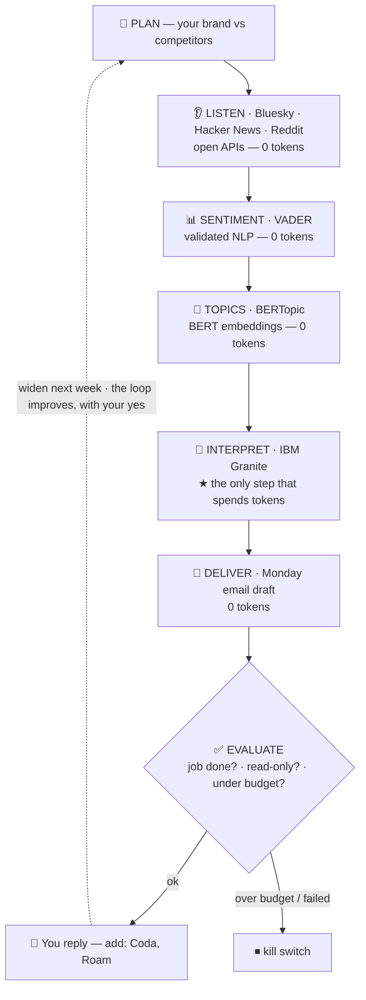

# Loop Engineering, by Hand — a Weekly Competitor-Listening Agent

**▶️ Run the demo:**  &nbsp;•&nbsp; **🧩 Start from the blank template:** 

*The **DEMO** runs as-is (Notion vs. its rivals). The **TEMPLATE** is the same notebook with 👉 `[ADD ... HERE]` blanks for your own product — fork it and make it yours.*

> **An introductory, hands-on demo of loop engineering.**
> Built for the **AI Tinkerers** community.
> **Created by Dr. Jeanne McClure · [Ars Innovate](https://arsinnovate.com).**

## What is this?

A hands-on look at **loop engineering** — the skill behind AI agents.

An **agent** is an LLM that doesn't just answer once. It runs in a **loop**: look at a goal → take an action → check the result → adjust → repeat, until the job is done. **Loop engineering** is deciding, step by step, *which tool each part of that loop deserves* — and reserving the (paid) LLM for the one job only it can do.

To make that concrete, this notebook builds a **weekly competitor-listening agent**: point it at your product and its rivals, and every week it listens across open platforms (Bluesky, Hacker News, Reddit), measures the mood, models the topics, and drafts you a Monday email showing where you're winning, losing, and the gaps to attack — running on **open models, no API keys**.

The one decision loop engineering is really about: *save the LLM for the one job only it can do* — the expensive step. Here Granite runs **free** on your own GPU via [Ollama](https://ollama.com), so we meter its tokens not because you're billed today, but because the same discipline is what keeps the bill sane the moment you swap in a hosted model.

No code required to run it. Every step explains itself in plain language first.

## How it works

*Three-quarters of the work runs on free, validated tools; the LLM shows up once, for judgment; a kill switch caps the cost; and every Monday you stay in the loop.*

## Built with

| Tool | Role here |
|---|---|
| **[IBM Granite](https://www.ibm.com/granite)** | the open LLM that does the strategic reasoning |
| **[Ollama](https://ollama.com)** | runs Granite locally for free — no API keys |
| **[BeeAI](https://github.com/i-am-bee)** | agent framework — Part B, the agent runs its own loop *(created by IBM, now a Linux Foundation project)* |
| **[VADER](https://github.com/cjhutto/vaderSentiment)** (NLTK) | validated sentiment analysis for social text |
| **[BERTopic](https://maartengr.github.io/BERTopic/)** | topic modeling with BERT embeddings + c-TF-IDF |
| **Bluesky · Hacker News · Reddit** | the open sources it listens to |
| Python · scikit-learn · pandas · matplotlib | the glue and the charts |

## How the loop spends (and saves) tokens

The point of loop engineering is putting the right engine on each step — so the cheap, validated tools do the grunt work for **zero tokens** and the LLM only shows up for strategy:

| Step | Tool | Token cost |
|---|---|---|
| **Listen** — Bluesky + Hacker News (+ Reddit, optional) | open APIs | 0 |
| **Sentiment** | VADER | 0 |
| **Topics** | BERTopic | 0 |
| **Interpret · find gaps · propose new signals** | IBM Granite | a little — *only here* |
| **Deliver · ask what to watch next** | a Monday-morning email you can reply to | 0 |

The loop even **improves itself**: Granite proposes competitors it wasn't asked to track, the Monday email asks if you want them, and your reply widens next week's listening — self-improvement with a human gate.

It also shows both sides of loop engineering side by side: **Part A** — *you* engineer the loop (the [Ralph loop](https://ghuntley.com/), coined by Geoffrey Huntley); **Part B** — the *agent* engineers its own loop (BeeAI).

## Run it

1. Open in Colab (badge above) → **File → Save a copy in Drive**.
2. **Runtime → Change runtime type → T4 GPU → Save**.
3. **Runtime → Run all**. First setup takes ~3 minutes.
4. Edit `PLAN` (Step 1) to your own product + competitors, then Run all again.

Reddit is optional and needs free credentials; everything else runs with no keys. The final step can wire **real email delivery** (Gmail or Outlook, via an app password) — off by default.

## Prompt vs. Context vs. Loop engineering

| Approach | What you shape | Reach for it when |
|---|---|---|
| **Prompt engineering** | the wording of one request | you want one good answer |
| **Context engineering** | what the model can see — docs, data, tools | it needs the right facts/tools in front of it |
| **Loop engineering** | the *steps* the model repeats — gather, reason, check, adjust | the work repeats or runs itself (this agent) |

---

## Credit & License

**© 2026 Dr. Jeanne McClure · Ars Innovate.** Licensed under **[Creative Commons Attribution-NonCommercial 4.0 International (CC BY-NC 4.0)](https://creativecommons.org/licenses/by-nc/4.0/)**.

You are free to **share and adapt** this material for **non-commercial** purposes, **with attribution** to Dr. Jeanne McClure / Ars Innovate. Please keep the credit and pass it on — a lot of work goes into sharing these resources. For commercial use, please get in touch.

Standing on the shoulders of: the **Ralph loop** (Geoffrey Huntley); Goal → Action → Observation → Adjustment framing (IBM); **VADER** (Hutto & Gilbert, 2014); **BERTopic** (Grootendorst, 2022); **Granite** (IBM); **BeeAI** (created by IBM, now a Linux Foundation project). The **ICI** (Instruction · Context · Input) prompting framework and the **From Vibes to Evidence** evaluation framework are © Dr. Jeanne McClure / Ars Innovate.
